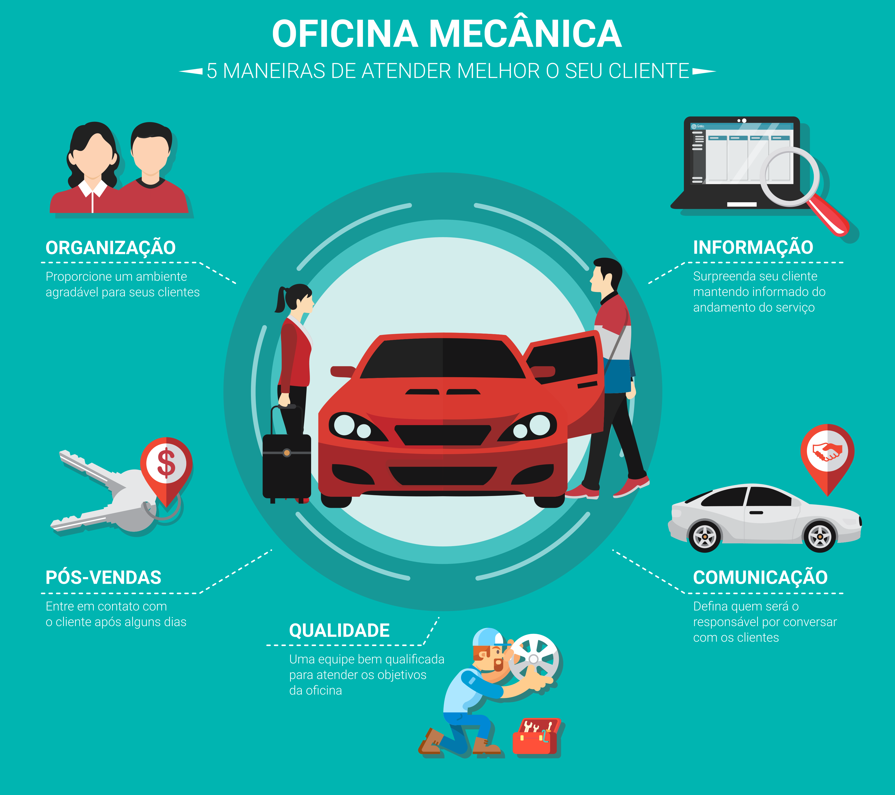

---  
layout: post
title: Oficinas mecânicas - 5 maneiras de atender melhor o seu cliente 
subtitle: Por que muitas pessoas preferem levar seus veículos diretamente nas concessionárias ao invés de pequenas oficinas mecânicas? 
bigimg: /img/5-maneiras-de-atender-melhor-o-seu-cliente.png  
tags: [Oficina, Organização, Gerenciamento]  
---

# Oficinas mecânicas: 5 maneiras de atender melhor o seu cliente

Por que muitas pessoas preferem levar seus veículos diretamente nas concessionárias ao invés de pequenas oficinas mecânicas? Você já parou para pensar nisso alguma vez?

Existem pequenas oficinas que prestam ótimos serviços, mas sempre há a exceção.

Estas oficinas de baixa qualidade acabam afetando a imagem das pequenas oficinas, mas cabe a você melhorar a imagem da sua oficina para converter um ótimo atendimento em mais serviços realizados.

Nesse artigo estaremos apresentando 5 dicas matadoras para atender melhor o seu cliente.

## 1. A primeira imagem é a que fica
Inicialmente mantenha sua oficina organizada, limpa e com um lugar reservado ao atendimento dos clientes, e que seja confortável.

A oficina também deve conter ter um visual que atenda tanto o público masculino como feminino, esses diferentes públicos devem se sentir à vontade de frequentar sua oficina. Essa sensação de conforto promove uma maior fidelização dos clientes, onde o cliente que se sentir à vontade poderá indicar sua oficina à amigos.

Sobre sua equipe de mecânicos, não há necessidades de forçar a utilização de roupas brancas, digamos que roupas brancas e oficinas não combinam. Fora que seus mecânicos ficarão extremamente insatisfeitos em ter que limpar uniformes brancos.

## 2. Defina quem será responsável por conversar com os clientes
Infelizmente não são todas as pessoas que possuem características para atendimento. E para atender os clientes não há nada melhor que uma pessoa comunicativa e sociável.

Caso os mecânicos sejam os responsáveis pelo atendimento, selecione um que possui uma boa característica de comunicação e paciência. Utilize este mecânico para conversar com os clientes, e repassar as informações aos demais mecânicos.

Não há nada mais desagradável que chegar em um lugar e ser mal atendido. Faça sua oficina ser referência em atendimento ao cliente.

## 3. Uma equipe qualificada irá enfrentar qualquer desafio
Tenha uma equipe qualificada que consiga resolver os problemas dos clientes sem realizar gambiarras que prejudiquem ainda mais os veículos. Há um excesso de serviços realizados extremamente desleixados no mercado, que acabam queimando a imagem da oficina.

Um serviço mal realizado é custo extra para oficina, fora que a possibilidade de perder o cliente é certa.

## 4. Mantenha seu cliente informado
Surpreenda seu cliente mantendo informado do andamento do serviço do veículo. Aproveite da tecnologia, hoje quase todo mundo possui WhatsApp, e converse com o seu cliente. Tenha certeza que isso irá agregar muito valor à sua oficina.

Grandes concessionárias aproveitam deste artifício de informação para fidelizar seus clientes, aproveite estes artifícios ao seu favor.

## 5. Realize o pós-venda
Após entregar o veículo ao seu cliente, aguarde alguns dias e ligue para ele. Pergunte se o serviço realizado no veículo está atendendo as expectativas do cliente, se o atendimento realizado pela oficina foi bom e ofereça um convite para o cliente voltar quando houver necessidades.

Poucas oficinas realizam o pós-venda, mas essa é uma ferramenta incrível para fidelização de clientes. Grandes concessionárias realizam essa técnica para fidelizar clientes.

Essas foram algumas dicas que são simples, mas que são extremamente poderosas para tornar sua oficina mecânica incrível. Comece aplicar hoje mesmo e veja sua oficina evoluir.

Até mais.

