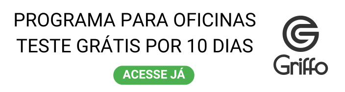

---  
layout: post
title: 'Lisa: a primeira assistente virtual para oficinas do Brasil' 
subtitle: A revolução nas suas mãos - descubra os incríveis benefícios da primeira assistente virtual de oficinas para otimizar suas tarefas e impulsionar seus resultados!
bigimg: /img/pexelsfundo1.png  
tags: [Oficina, Organização, Gerenciamento]  
---

Descubra o poder transformador da Lisa, a assistente virtual revolucionária que vai além das suas expectativas. Prepare-se para uma experiência única, onde a tecnologia encontra a inteligência emocional para proporcionar um atendimento excepcional aos seus clientes.

Com a Lisa, sua empresa ganha uma aliada incomparável. Ela não apenas executa tarefas administrativas, mas também estabelece um vínculo emocional com seus clientes. Por meio de mensagens personalizadas e lembretes estratégicos, Lisa mantém um relacionamento próximo com cada um deles, garantindo que retornem para manutenções, reparos ou outros serviços essenciais.

Essa interação personalizada é um verdadeiro gatilho mental, despertando o senso de urgência nos clientes e incentivando-os a agir. Ao receber lembretes atenciosos de Lisa, eles se sentem valorizados e compreendidos, aumentando a fidelidade à sua marca e fortalecendo a relação de confiança.

Além disso, Lisa é uma fonte inesgotável de insights valiosos. Com sua capacidade de coletar e analisar dados, ela fornece informações estratégicas sobre o comportamento dos clientes, permitindo que você tome decisões embasadas e direcione seus esforços de forma mais eficiente.

Prepare-se para surpreender seus clientes e superar todas as expectativas com Lisa, a assistente virtual que vai além do comum. Com sua combinação única de tecnologia e empatia, ela impulsiona o crescimento do seu negócio, fortalece o relacionamento com os clientes e abre portas para novas oportunidades. 

## Beneficios de ter a Lisa no sistema da sua oficina

## 1. Envio a O.S digital
Quando é dado a entrada do veículo na oficina e no Griffo, a Lisa manda na mesma hora uma mensagem no WhatsApp do seu cliente com o link da ***Ordem de Serviço Digital***, que ele pode acompanhar remotamente tudo que está sendo feito em seu veículo.

## 2. Pesquisa de satisfação do atendimento
Após a conclusão do serviço, é encaminhada, por meio do WhatsApp, uma pesquisa de satisfação referente ao atendimento prestado pela oficina. Essa pesquisa tem como objetivo avaliar a experiência do cliente e obter feedback sobre a qualidade dos serviços oferecidos.

## 3. Lembrete de revisão
A fim de recordar aos clientes sobre a necessidade de realizar uma revisão em seus veículos, a Lisa envia uma mensagem através do WhatsApp.

